# RoutineMe — everyday self-tracking without the chore

**RoutineMe is a habit and routine tracker designed to make everyday self-tracking easier — from recurring habits to calories and nutrients — without turning logging into another chore.**

Nutrition is where natural language helps most: instead of searching a food database and filling in every field, you describe what you ate and the system structures the log. The AI layer is designed to assist rather than silently take control — retrieval, evaluation, explicit uncertainty, and confirmation boundaries make the natural-language workflow dependable.

```text
User:    "Had 2 eggs and a slice of toast for breakfast."
              ↓
RoutineMe interprets the meal
              ↓
resolves known foods + prior entries
              ↓
structures the nutrition log
              ↓
user reviews the result

BOT     Found both:
          2 eggs           ≈ 140 kcal   P 12g · F 10g · C 1g
          1 slice of toast ≈  80 kcal   P  3g · F  1g · C 15g
        Log these?                                  ← proposes, waits for confirmation
```

## The Product

Tracking habits and routines fails the same way every time: logging becomes a chore, so it stops happening. RoutineMe is built around making the logging moment as light as possible — a habit checked off, a weight entered, a goal nudged, or a meal described in one sentence. It's for people who want the record and the insight without the data-entry tax.

## What This Showcase Covers

> **About this repository**
>
> This is a public showcase of selected engineering from the larger private RoutineMe project. It is intentionally not the full application. The repository focuses on a technically meaningful subsystem that can be demonstrated publicly without exposing private code, data, or infrastructure.

**Showcase focus: the natural-language logging workflow.** Using nutrition logging as the example, this repository exposes the AI engineering behind the product: interpreting what a user types, grounding it in their own history, handling uncertainty honestly, evaluating that behavior continuously, and keeping every state change behind an explicit confirmation.

## See It Work

The same workflow holds when the system *doesn't* know, and when the user asks it to *change* something:

```text
User:    "Had one serving of zxq mystery powder."
BOT     I can't identify "zxq mystery powder" reliably.
        I can log it as unknown — I won't guess the nutrition.
                                                    ← honest fallback, nothing invented

User:    "Change my daily calorie target to 1,800."
BOT     Proposed change: daily target → 1,800. Apply?
        Nothing is written until you confirm.       ← bounded action, explicit confirm
```

Run the evaluation suite that pins this behavior:

```bash
npm install
npm test          # keyless — no API key, no network, no database
```

```text
Test Files  6 passed (6) | Tests  40 passed (40)

golden eval: classifier accuracy vs floor
{ "step": "classifier", "floor": 0.7, "count": 17, "matched": 17, "accuracy": 1 }

golden eval: estimator coverage + unknown-bounds vs floors
{ "step": "estimator", "coverageFloor": 0.8, "unknownBoundsFloor": 0.6,
  "coverageRate": 1, "unknownBoundsRate": 1, ... }
```

What you're seeing (verbatim from the run, captured in `docs/golden-eval-run.txt`): checked-in cases pin the *behavior* — 17 classifier cases, and estimator cases where known foods must be covered and genuinely unknown foods must come back `unknown` with zeroed macros ("some weird alien food xyzzy" → `unknown: true`, never fabricated). Scores are held to floors, so a model or prompt change that degrades behavior fails the suite. The default run uses a deterministic stand-in for the live LLM so the harness runs anywhere with no key; the live model runs the exact same cases and must clear the same floors.

## How It Works

```mermaid
flowchart LR
    U["User message"] --> C["Classify intent"]
    C --> N["Resolve foods<br/><i>against the user's own history</i>"]
    N --> E["Estimate nutrition<br/><i>unknown foods stay unknown</i>"]
    E --> P["Propose change"]
    P --> CF["Confirm"]
    CF --> X["Execute"]

    EV["Behavior test cases<br/><i>(evals)</i>"] -.->|score| C
    EV -.->|score| E
    OB["Per-call metrics<br/><i>latency · tokens · cost</i>"] -.->|records| C
    OB -.->|records| E
    style EV fill:#1e3a2f,stroke:#27c93f
    style OB fill:#1e3a2f,stroke:#27c93f
```



Every write goes through one typed action executor with a propose → confirm → execute lifecycle. The chat pipeline doesn't have its own private way to mutate data — it proposes, you confirm, then the same executor runs.

## Engineering Highlights

### 1. Natural-language meal logging

"2 eggs and toast" becomes a structured log without a form. The pipeline classifies the intent, resolves each food, estimates macros, and proposes the log entry — then waits. The user reviews before anything is written.

### 2. Grounding against known foods and user history

"Rice" should mean *the rice this user usually eats*. Before estimating, the assistant looks at the user's recent logs, ranks them by frequency and recency, and reuses previously-confirmed values verbatim when a food matches. No vector database, no embedding pipeline — a bounded scan of the user's own history, degrading to empty (never to a guess) when lookup fails.

### 3. Evaluation of AI behavior

The eval suite pins behavior with concrete failure classes: an unsupported food must come back `unknown` (never invented macros), every known food must be covered, and the classifier must route ambiguous input correctly. Scores are checked against conservative floors, so a model or prompt change that degrades behavior fails the suite instead of shipping. These run in CI with no API key — the harness is deterministic even though the behavior it scores is the model's.

### 4. Guarded state-changing actions

The assistant can propose; only the user can commit. Mutations flow through schema-validated typed actions that require an explicit confirmation step, and any model-driven follow-up loop is hard-capped at three steps — a confused model can waste a little latency, not take uncontrolled actions on real data.

## Project Status

| Capability | Status |
|---|---|
| Habit and routine tracking (habits, streaks, numeric goals) | Built |
| Nutrition tracking (calories, macros) | Built |
| Natural-language meal interpretation | Built — demonstrated in this showcase |
| Retrieval from known/user data | Built — demonstrated in this showcase |
| AI evaluation harness | Built |
| Agent-assisted logging workflows (bounded follow-up proposals) | Built |
| Proactive, scheduled routine management | In development |

## Run This Showcase

```bash
npm install
npm test
```

No API key, no network, no database. TypeScript strict, Zod-validated, Vitest.

## Public Showcase Scope

| Component | Status | Notes |
|---|---|---|
| Eval scoring, golden fixtures | **Real** | Copied verbatim, de-identified. |
| Retrieval ranking, observability, agentic loop, estimator contract | **Real** | Copied; storage boundaries abstracted behind interfaces. |
| Deterministic model stand-in | **Reconstructed** | Lets the harness run keyless; clearly labeled in code. |
| LLM client, database, auth, app UI | **Omitted** | Private infrastructure; documented, not shipped. |
| Credentials, deploy URLs, project refs | **Redacted** | None present. |

## About

Built by Sebastian O. Rodriguez. The private RoutineMe project is a deployed habit-and-nutrition app; this showcase carries its AI engineering — the part that decides whether natural-language logging can be trusted.
