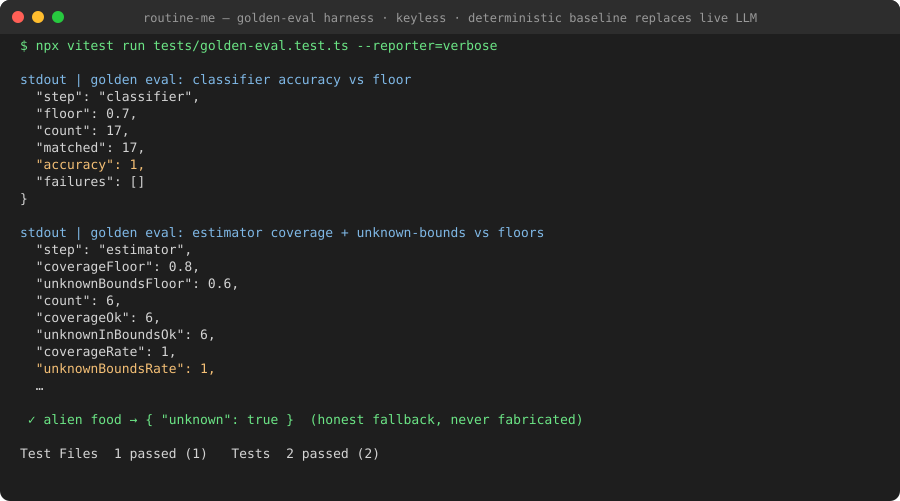
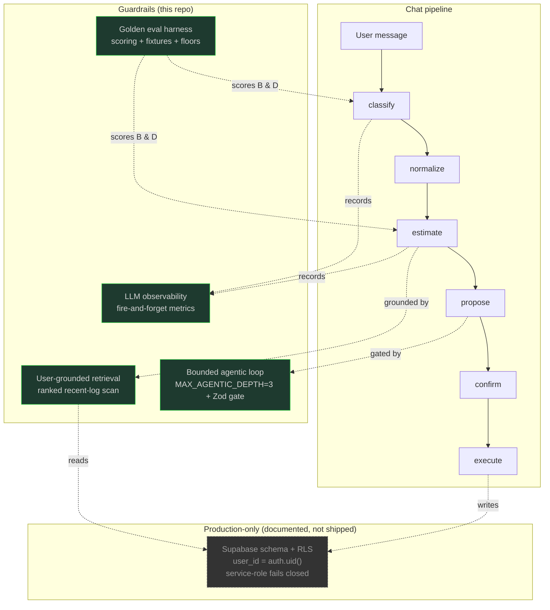

# RoutineMe — AI Evidence Layer

**Every LLM call is golden-tested, traced, cost-audited, and user-grounded — and unsafe steps fail closed.** This repo is a standalone showcase of the AI-evidence layer behind a habit/nutrition tracker's chat surface: golden evals with regression floors, fire-and-forget observability, user-grounded retrieval, and a bounded agentic loop.



---

## What It Does

The product is a habit + nutrition tracker whose natural-language chat is *guarded*, not vibes-checked. When a user types "had two eggs and toast for breakfast", a pipeline classifies intent, retrieves the user's own past logs, estimates macros, proposes a change, asks for confirmation, and only then executes — while every LLM call is recorded off the critical path.

This showcase isolates the **AI evidence layer** — the discipline around the LLM — as pure TypeScript:

| Component | What it proves |
| --- | --- |
| **Golden eval harness** | Classifier accuracy + estimator unknown-bounds are scored against checked-in golden fixtures and held to regression floors. |
| **Honest unknown-fallback** | The estimator tags unrecognized foods `unknown` (zeroed macros) instead of fabricating numbers. |
| **LLM observability** | Per-call latency / tokens / estimated-cost / fallback, fire-and-forget off the request path. |
| **User-grounded retrieval** | A ranked recent-log scan (no vector infra) lets the estimator reuse a food the user logged before. |
| **Bounded agentic loop** | `MAX_AGENTIC_DEPTH = 3` + a Zod union gate; malformed next-steps fail closed. |

## Demo

The demo *shows* quality floors rather than asserting them. `npm test` runs the full harness keylessly — no API key, no network, no database:

```
$ npx vitest run tests/golden-eval.test.ts --reporter=verbose

stdout | golden eval: classifier accuracy vs floor
{
  "step": "classifier",
  "floor": 0.7,
  "count": 17,
  "matched": 17,
  "accuracy": 1,
  "failures": []
}

stdout | golden eval: estimator coverage + unknown-bounds vs floors
{
  "step": "estimator",
  "coverageFloor": 0.8,
  "unknownBoundsFloor": 0.6,
  "count": 6,
  "coverageOk": 6,
  "unknownInBoundsOk": 6,
  "coverageRate": 1,
  "unknownBoundsRate": 1,
  ...
  ✓ alien food → { "unknown": true }   (honest fallback, never fabricated)
}
```

The deterministic reference baseline stands in for the real model so the *harness* (load → run → score → floor-check) executes end-to-end with no key. The production model runs through the same harness under the original repo's `evals` command; only the model under test differs.

## Architecture



The four guardrails are the point: the pipeline is ordinary; the *evidence* that the pipeline is trustworthy is not. Every guardrail is a pure, unit-tested module in `src/`.

## Engineering Highlights

**1. Golden evals with regression floors + honest unknown-fallback.**
*Constraint*: LLM behavior drifts silently as models/prompts change, and a nutrition estimator that guesses wrong is worse than one that admits it doesn't know.
*Implementation*: checked-in `golden-classifier.json` / `golden-estimator.json` fixtures define the expected scenario (and, for the estimator, allowed unknown-count bounds) per input. `computeClassifierStats` / `computeEstimatorStats` score runs against floors (0.7 accuracy, 0.8 coverage, 0.6 unknown-bounds).
*Tradeoff*: floors are deliberately conservative to catch drift without flaky hard-fails; they raise as the harness stabilizes.
*Result*: the demo above scores the harness end-to-end keylessly, and the estimator's alien-food case is pinned to `unknown: true`.

**2. Fire-and-forget LLM observability off the critical path.**
*Constraint*: observability must never add latency to, or break, the request path.
*Implementation*: `recordAiCall` returns `void` and never throws; the persistence boundary is an injected sink (no-op by default). `estimateCostUsd` and `summarizeAiHealth` are pure and unit-tested.
*Tradeoff*: approximate token pricing is captured for trend visibility, not billing-grade accuracy (disclosed in code).
*Result*: cost/latency/fallback-rate roll up into a per-step health summary without touching the hot path.

**3. User-grounded retrieval with no vector infra.**
*Constraint*: the estimator should reuse what *this* user logged before, but standing up an embedding store is heavy for a first cut.
*Implementation*: a bounded recent-log scan (300 rows) grouped by normalized item, ranked by frequency then recency, handed to the estimator as `priorFoods`.
*Tradeoff*: recall is bounded by the scan window and exact-ish matching; the boundary is an interface so an embedding store can replace it later without touching the estimator.
*Result*: the "breakfast bowl" golden case verifies a repeated food reuses its previously logged macros.

**4. Bounded agentic loop with a Zod union gate.**
*Constraint*: an unbounded "let the model keep acting" loop is a runaway-cost and runaway-action risk.
*Implementation*: `MAX_AGENTIC_DEPTH = 3` hard-caps follow-ups; the model's next-step is validated against a Zod discriminated union — `{done}` or `{next: ActionPayload}` — and any malformed/unknown output ends the loop.
*Tradeoff*: a strict schema rejects creative-but-untyped proposals, which is exactly the fail-closed behavior wanted for mutations.
*Result*: `parseAgenticResponse` is pure and unit-tested; depth-guard returns `null` at the cap.

**5. Server-derived identity + fail-closed admin.**
*Constraint*: client-supplied user IDs and admin keys must not be trusted.
*Implementation*: user identity is server-set on every action; the admin client is no-oped entirely when its secret key is absent.
*Tradeoff*: the actual Supabase schema/RLS is *omitted* from this public repo (private infra) — its role is documented above and in `docs/architecture.md`.
*Result*: the observability/trace sinks fail to a no-op (never throw, never write) when unconfigured.

## Technical Deep Dive

### The golden eval harness (`src/eval/`)

`scoring.ts` is pure and deterministic — it loads fixtures, validates them (`unknownAtLeast ≤ unknownAtMost`, non-empty inputs), and computes stats. It deliberately separates *what the model must return* (fixtures) from *how we measure it* (scoring) from *what the model actually is* (injected under test). That separation is what lets the harness run in CI with no LLM key: `tests/evals-harness.test.ts` verifies fixture validity + scoring math with synthetic runs, while `tests/golden-eval.test.ts` runs the end-to-end loop with a deterministic baseline.

### The estimator's unknown contract (`src/chat-estimator.ts`)

`estimateNutrition` has a single failure path: any network/parse/schema error returns `allUnknown(items)` — every item tagged `unknown` with zeroed macros. It *never* invents numbers. `buildEstimatorUserContent` injects prior foods and an explicit "reuse verbatim" instruction; `formatNutritionProposal` prefixes estimates with `~` and asks for confirmation.

### The observability boundary (`src/llm-observability.ts`, `src/trace.ts`)

Both expose an injectable sink with a no-op default. The contract — "fire-and-forget, never throw" — is preserved even though the persistence target (a Supabase table) is out of scope here. `summarizeAiHealth` and `estimateCostUsd` are the pure, tested core.

## Tech Stack

- **TypeScript** (strict) — the entire evidence layer is typed.
- **Zod** — schema-validated classifier/estimator/action outputs.
- **Vitest** — the deterministic, keyless test suite.
- *(Production only, not in this repo: Expo, Supabase/Postgres, OpenRouter — see disclosure.)*

## Run It

```bash
npm install        # one-time
npm test           # npx vitest run — keyless, no network, no DB
```

Expect `Test Files 6 passed (6) | Tests 40 passed (40)` and the golden-eval stdout above.

## Design Decisions / Tradeoffs

- **Deterministic baseline as the model-under-test stand-in.** The real model needs an API key; the harness must not. A keyword/table baseline (`src/eval/reference-model.ts`) exercises load → run → score → floor-check with no key, clearly labeled as reconstructed.
- **Floors over exact-match assertions.** Floors (0.7 / 0.8 / 0.6) tolerate a small number of misses so drift is caught without flaky hard-fails on a single re-roll.
- **Inject the boundary, keep the core pure.** Supabase, the LLM client, and trace persistence are all interfaces with no-op/default or injected implementations, so every piece of *logic* is unit-testable in isolation.
- **Omit private infra, keep its contract.** The production schema/RLS is a mermaid node + a paragraph, not shipped code — truthful about what exists without leaking it.

## Public Showcase Scope

| Component | Status | Notes |
| --- | --- | --- |
| Golden eval scoring (`scoring.ts`) | **Real** | Copied verbatim, de-identified. |
| Golden fixtures (`.json`) | **Real** | Copied verbatim. |
| Classifier/estimator/action schemas, prompts | **Real** | Copied, product name neutralized. |
| Retrieval ranking, observability math, trace | **Real** | Copied; storage boundary abstracted. |
| `reference-model.ts` (baseline) | **Reconstructed** | Deterministic stand-in so evals run keyless. |
| LLM client, Supabase client | **Omitted** | Require API keys / private infra. |
| Supabase schema + RLS | **Omitted** | Documented in mermaid + architecture, not shipped. |
| Expo app, UI, server routes, migrations | **Omitted** | Out of scope for the evidence layer. |
| Credentials, secrets, deploy URLs, project refs | **Redacted** | None present; secret-scan clean. |

## About

Extracted from a private multi-user habit/nutrition tracker as a portfolio showcase of LLM-quality discipline: regression floors, honest-fallback, observability, grounding, and bounded autonomy — not vibes. The pipeline is ordinary; the evidence it's trustworthy is the engineering.
