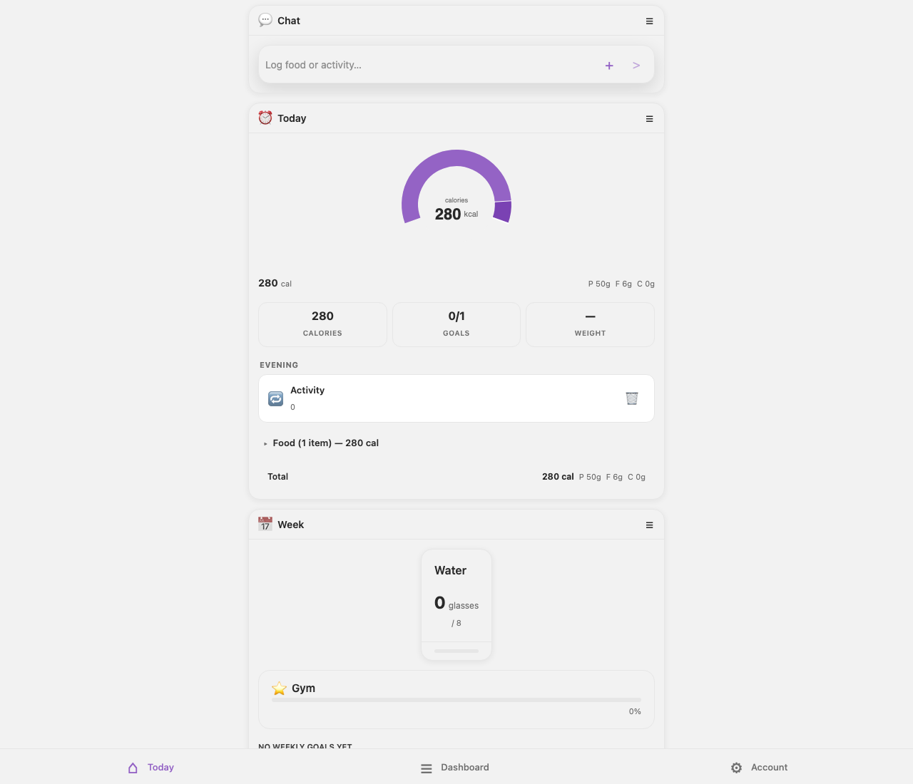
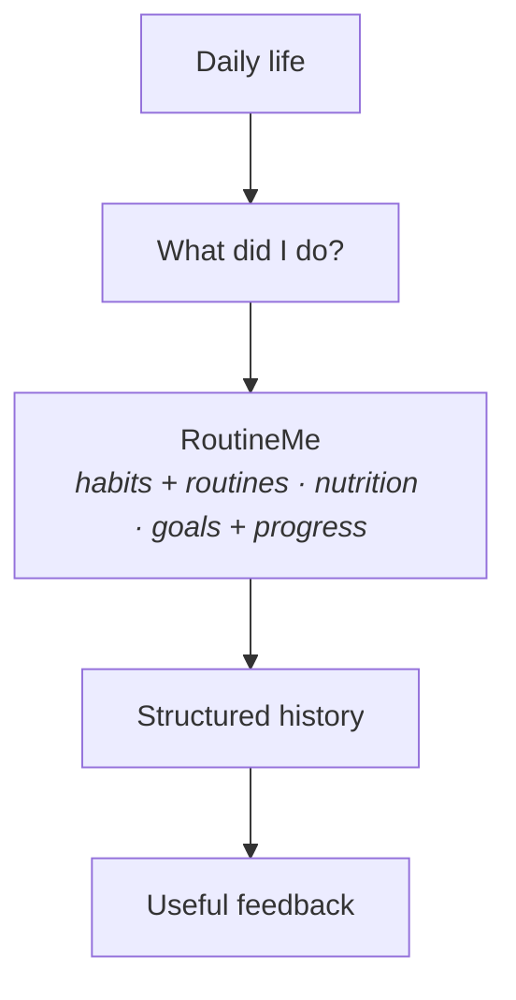
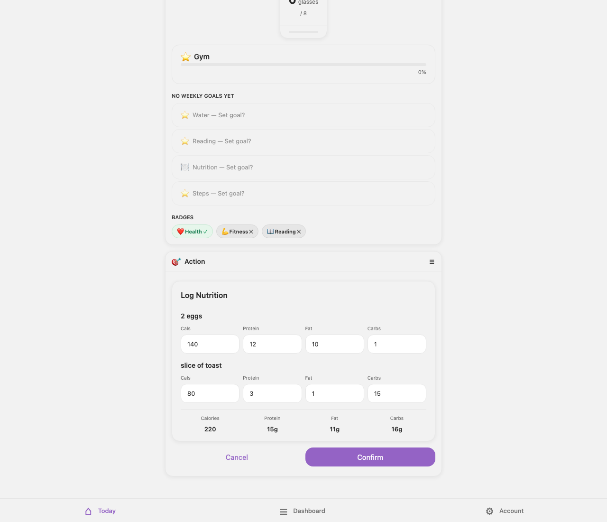

# RoutineMe — everyday self-tracking without the chore

**RoutineMe is a habit and routine tracker designed to make everyday self-tracking easier — from recurring habits and goals to calories and nutrients.**

A major design goal is reducing logging friction. For nutrition, that means letting someone describe a meal naturally instead of searching for every food and manually entering every field.

<a href="docs/assets/product-today.png">
  
</a>

*Today view — habits, routines, and nutrition live in the same daily tracking workflow: a calorie gauge, macro totals, goals with progress, and the week at a glance.*



One app answers that question across everything being tracked. Nutrition is the workflow where typing a sentence replaces a form — and where the AI engineering in this repository lives.

## What this repository shows

This repository is not the full RoutineMe application. It exposes a public-safe slice of the AI engineering behind natural-language logging.

The showcase demonstrates how free-form input is interpreted, grounded against known information, evaluated against expected behavior, and kept behind explicit confirmation before state-changing actions.

**Public showcase focus: the natural-language nutrition workflow.** This is what the engineering makes possible:

```text
"Chicken wrap and iced coffee"
              ↓
       interpret meal
              ↓
     match known data + prior entries
              ↓
      structured proposal
              ↓
        user confirms
              ↓
            saved
```

And the real thing doing it (live model, demo account):

<a href="docs/assets/product-meal-logging.png">
  
</a>

*Natural-language meal logging — RoutineMe turns a free-form description into a structured nutrition proposal before anything is saved.*

When the system *doesn't* know, or the user asks it to *change* something:

```text
User:    "Had one serving of zxq mystery powder."
BOT     I can't identify "zxq mystery powder" reliably.
        I can log it as unknown — I won't guess the nutrition.
                                                    ← honest fallback, nothing invented

User:    "Change my daily calorie target to 1,800."
BOT     Proposed change: daily target → 1,800. Apply?
        Nothing is written until you confirm.       ← bounded action, explicit confirm
```

## Turning natural language into a safe structured action


Every write goes through one typed action executor with a propose → confirm → execute lifecycle. The chat pipeline doesn't have its own private way to mutate data — it proposes, you confirm, then the same executor runs.

## Engineering highlights

### 1. Natural-language meal logging

"2 eggs and toast" becomes a structured log without a form. The pipeline classifies the intent, resolves each food, estimates macros, and proposes the log entry — then waits. The user reviews before anything is written.

### 2. Grounding against known foods and user history

"Rice" should mean *the rice this user usually eats*. Before estimating, the assistant looks at the user's recent logs, ranks them by frequency and recency, and reuses previously-confirmed values verbatim when a food matches. No vector database, no embedding pipeline — a bounded scan of the user's own history, degrading to empty (never to a guess) when lookup fails.

### 3. Evaluation of AI behavior

The eval suite pins behavior with concrete failure classes: an unsupported food must come back `unknown` (never invented macros), every known food must be covered, and the classifier must route ambiguous input correctly. Scores are checked against conservative floors, so a model or prompt change that degrades behavior fails the suite instead of shipping. These run in CI with no API key — the harness is deterministic even though the behavior it scores is the model's.

### 4. Guarded state-changing actions

The assistant can propose; only the user can commit. Mutations flow through schema-validated typed actions that require an explicit confirmation step, and any model-driven follow-up loop is hard-capped at three steps — a confused model can waste a little latency, not take uncontrolled actions on real data.

## Engineering proof: evaluating AI behavior

A meal-logging workflow can look correct in a demo and still fail unpredictably on unfamiliar foods, ambiguous inputs, or state-changing requests. RoutineMe uses repeatable evaluation cases to make those failures visible during development.

The suite runs keyless — no API key, no network, no database:

```bash
npm install
npm test
```

```text
Test Files  6 passed (6) | Tests  40 passed (40)

golden eval: classifier accuracy vs floor
{ "step": "classifier", "floor": 0.7, "count": 17, "matched": 17, "accuracy": 1 }

golden eval: estimator coverage + unknown-bounds vs floors
{ "step": "estimator", "coverageFloor": 0.8, "unknownBoundsFloor": 0.6,
  "coverageRate": 1, "unknownBoundsRate": 1, ... }
```

What you're seeing (verbatim from the run, captured in `docs/golden-eval-run.txt`): checked-in cases pin the *behavior* — 17 classifier cases, and estimator cases where known foods must be covered and genuinely unknown foods must come back `unknown` with zeroed macros ("some weird alien food xyzzy" → `unknown: true`, never fabricated). Scores are held to floors, so a model or prompt change that degrades behavior fails the suite. The default run uses a deterministic stand-in for the live LLM so the harness runs anywhere with no key; the live model runs the exact same cases and must clear the same floors.

## Project status

| Capability | Status |
|---|---|
| Habit and routine tracking (habits, streaks, numeric goals) | Built |
| Nutrition tracking (calories, macros) | Built |
| Natural-language meal interpretation | Built — demonstrated in this showcase |
| Retrieval from known/user data | Built — demonstrated in this showcase |
| AI evaluation harness | Built |
| Agent-assisted logging workflows (bounded follow-up proposals) | Built |
| Proactive, scheduled routine management | In development |

## Run this showcase

```bash
npm install
npm test
```

No API key, no network, no database. TypeScript strict, Zod-validated, Vitest.

## Public showcase scope

| Component | Status | Notes |
|---|---|---|
| Eval scoring, golden fixtures | **Real** | Copied verbatim, de-identified. |
| Retrieval ranking, observability, agentic loop, estimator contract | **Real** | Copied; storage boundaries abstracted behind interfaces. |
| Deterministic model stand-in | **Reconstructed** | Lets the harness run keyless; clearly labeled in code. |
| LLM client, database, auth, app UI | **Omitted** | Private infrastructure; documented, not shipped. |
| Credentials, deploy URLs, project refs | **Redacted** | None present. |

Product screenshots above come from the private application running against a local demo environment with synthetic data.

## About

Built by Sebastian O. Rodriguez. The private RoutineMe project is a deployed habit-and-nutrition app; this showcase carries its AI engineering — the part that decides whether natural-language logging can be trusted.
