# RoutineMe — a nutrition assistant that knows what it doesn't know

RoutineMe is a nutrition tracker you talk to in plain language. It understands food logs, estimates nutrition, and changes your data — with one rule baked in everywhere: **when it isn't sure, it says so instead of inventing an answer, and it never changes anything without asking.**

```text
USER    Had 2 eggs and a slice of toast for breakfast.

BOT     Found both:
          2 eggs           ≈ 140 kcal   P 12g · F 10g · C 1g
          1 slice of toast ≈  80 kcal   P  3g · F  1g · C 15g
        Log these?                                  ← proposes, waits for confirmation

USER    Had one serving of zxq mystery powder.

BOT     I can't identify "zxq mystery powder" reliably.
        I can log it as unknown — I won't guess the nutrition.
                                                    ← honest fallback, nothing invented

USER    Change my daily calorie target to 1,800.

BOT     Proposed change: daily target → 1,800. Apply?
        Nothing is written until you confirm.       ← bounded action, explicit confirm
```

Three behaviors tell the whole story: **grounded answers → honest uncertainty → no uncontrolled actions.**

## See It Work

```bash
npm install
npm test          # keyless — no API key, no network, no database
```

```text
Test Files  6 passed (6) | Tests  40 passed (40)

golden eval: classifier accuracy vs floor
{ "step": "classifier", "floor": 0.7, "count": 17, "matched": 17, "accuracy": 1 }

golden eval: estimator coverage + unknown-bounds vs floors
{ "step": "estimator", "coverageFloor": 0.8, "unknownBoundsFloor": 0.6,
  "coverageRate": 1, "unknownBoundsRate": 1, ... }
```

What you're seeing (verbatim from the run, captured in `docs/golden-eval-run.txt`): checked-in cases pin the *behavior* — 17 classifier cases, and estimator cases where known foods must be covered and genuinely unknown foods must come back `unknown` with zeroed macros ("some weird alien food xyzzy" → `unknown: true`, never fabricated). Scores are held to floors, so a model or prompt change that degrades behavior fails the suite. The default run uses a deterministic stand-in for the live LLM so the harness runs anywhere with no key; the live model runs the exact same cases and must clear the same floors.

## The Problem

Natural-language nutrition assistants have a dangerous failure mode: when the model is uncertain, it still sounds confident. "1 serving of zxq powder" comes back as *380 kcal, 12g protein* — invented, plausible, and wrong. For a health product, a confidently wrong number is worse than no number. And an assistant that can act (change your targets, log entries) needs a hard line between *suggesting* and *doing*.

## How It Works

```mermaid
flowchart LR
    U["User message"] --> C["Classify intent"]
    C --> N["Resolve foods<br/><i>against the user's own history</i>"]
    N --> E["Estimate nutrition<br/><i>unknown foods stay unknown</i>"]
    E --> P["Propose change"]
    P --> CF["Confirm"]
    CF --> X["Execute"]

    EV["Behavior test cases<br/><i>(evals)</i>"] -.->|score| C
    EV -.->|score| E
    OB["Per-call metrics<br/><i>latency · tokens · cost</i>"] -.->|records| C
    OB -.->|records| E
    style EV fill:#1e3a2f,stroke:#27c93f
    style OB fill:#1e3a2f,stroke:#27c93f
```



Every write goes through one typed action executor with a propose → confirm → execute lifecycle. The chat pipeline doesn't have its own private way to mutate data — it proposes, you confirm, then the same executor runs.

## Engineering Highlights

### 1. Grounded in the user's own history, not the model's memory

"Rice" should mean *the rice this user usually eats*. Before estimating, the assistant looks at the user's recent logs, ranks them by frequency and recency, and reuses previously-confirmed values verbatim when a food matches. No vector database, no embedding pipeline — a bounded scan of the user's own history, degrading to empty (never to a guess) when lookup fails.

### 2. Behavior tests, not vibes

The eval suite pins behavior with concrete failure classes: an unsupported food must come back `unknown` (never invented macros), every known food must be covered, and the classifier must route ambiguous input correctly. Scores are checked against conservative floors, so a model or prompt change that degrades behavior fails the suite instead of shipping. These run in CI with no API key — the harness is deterministic even though the behavior it scores is the model's.

### 3. Bounded autonomy

The assistant can propose; only the user can commit. Mutations flow through schema-validated typed actions that require an explicit confirmation step, and any model-driven follow-up loop is hard-capped at three steps — a confused model can waste a little latency, not take uncontrolled actions on real data.

## Technical Deep Dive: observability that never slows the answer

Every model call records latency, token usage, and estimated cost — but recording never sits on the critical path. The metrics sink is fire-and-forget by contract: it can never throw, never block, and degrades to a no-op when unconfigured. Pure functions roll the per-call records up into a health summary per pipeline step (fallback rate, average latency, spend), which is what makes the floors in the eval suite actionable — you can see a behavior change and the cost change together.

## Run It

```bash
npm install
npm test
```

No API key, no network, no database. TypeScript strict, Zod-validated, Vitest.

## Public Showcase Scope

| Component | Status | Notes |
|---|---|---|
| Eval scoring, golden fixtures | **Real** | Copied verbatim, de-identified. |
| Retrieval ranking, observability, agentic loop, estimator contract | **Real** | Copied; storage boundaries abstracted behind interfaces. |
| Deterministic model stand-in | **Reconstructed** | Lets the harness run keyless; clearly labeled in code. |
| LLM client, database, auth, app UI | **Omitted** | Private infrastructure; documented, not shipped. |
| Credentials, deploy URLs, project refs | **Redacted** | None present. |

Extracted from a private, deployed habit-and-nutrition app.

## About

Built by Sebastian O. Rodriguez. The hard part was not making the model work — it was designing the system so the model being wrong is a visible, bounded event instead of a silent wrong number.
