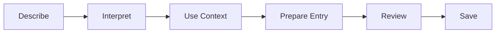

<h1>Routine Me: Less Friction, Better Self-Tracking</h1>

<em>A product and engineering showcase of Routine Me.</em>

<h2>Track More. Log Less.</h2>

Self-tracking is useful when the record stays consistent. The problem is that keeping the record often becomes another task to manage.

Routine Me brings habits, routines, goals, and nutrition into one daily workflow, with a focus on reducing the manual work required to keep that history useful.

  

<em>Today: Habits, routines, goals, and nutrition in one daily view.</em>

<h2>Logging Is the Bottleneck</h2>

Tracking breaks down when recording takes more effort than the insight is worth. Every extra search, field, form, and repeated entry adds friction to a habit that depends on consistency.

Routine Me is built around a simpler question: how much of that work can the software remove while keeping the user in control of what gets recorded?

<ul>
  <li>What did I complete today?</li>
  <li>Am I staying consistent with the routines that matter?</li>
  <li>How am I progressing toward my goals?</li>
  <li>What did I eat, and how does it affect today's nutrition?</li>
  <li>Where am I improving, slipping, or repeating the same patterns?</li>
</ul>

The value is not in collecting more data. It is in maintaining enough useful history to see patterns and act on them without turning tracking into a second job.

<h2>Track the Day in One Place</h2>

<h3>See What Matters Today</h3>

Routine Me brings habits, routines, goals, and nutrition into a single daily view. Progress, calorie targets, macros, recurring tasks, and weekly context stay visible without jumping between separate trackers.

The goal is simple: understand the day quickly, then get back to living it.

  

<em>Today: Daily progress without the dashboard sprawl.</em>

<h3>Log With Natural Language</h3>

Nutrition makes tracking friction obvious. Instead of searching for each ingredient and filling out fields manually, describe the meal the way you would say it.

Routine Me turns that description into a structured entry for review before anything is saved.

  

<em>Meal Logging: Describe the meal, review the entry, then save.</em>

<h3>Build a Useful History</h3>

Each completed habit, routine, goal, and meal becomes part of a structured record. That history makes trends, consistency, and recurring patterns visible over time instead of leaving activity trapped in disconnected daily entries.

The better the record, the more useful the feedback becomes.

<h2>From Description to Structured Entry</h2>

Natural-language logging is not a separate chatbot workflow. It is another input path into the same structured logging system.

The model interprets what the user means, relevant history provides context, and the application prepares an entry for review before any state changes.

That separation keeps natural-language input flexible without giving the model unrestricted control over stored data.

<h2>AI Proposes. The User Decides.</h2>

The useful part of AI is its ability to interpret messy, incomplete input. The dangerous part is when plausible output is treated as fact.

<blockquote>
<strong>AI handles interpretation. Confirmed data owns the record.</strong>
</blockquote>

<h3>Ground With Known Context</h3>

When possible, Routine Me uses previously confirmed entries to interpret new ones. If a user repeatedly logs the same food, that history provides stronger context than a fresh model estimate.

When reliable context is unavailable, the system should preserve uncertainty rather than silently invent precision.

<h3>Use One Write Path</h3>

Whether an entry starts from a form or natural language, state changes flow through the same structured action path. AI can prepare an action, but it does not bypass the application rules that govern how data is written.

<h3>Confirm Before Saving</h3>

Natural-language input follows a propose, review, execute lifecycle. The user sees the interpreted entry before it becomes part of the record.

This keeps convenience high without giving up control over personal data.

<h3>Keep Unknowns Unknown</h3>

Missing information should remain missing. An unfamiliar food, failed lookup, or ambiguous request should not become a confident fabricated value simply because the model can produce one.

<h3>Test the Behavior</h3>

Model and prompt changes are evaluated against repeatable cases covering ambiguous inputs, known foods, unknown foods, retrieval failures, and state-changing requests.

The objective is not to test whether the model sounds good. It is to verify that critical behaviors remain stable as the AI layer changes.

<h2>Do More of the Remembering</h2>

The long-term direction for Routine Me is to reduce logging further. If the software understands what a user typically tracks and when, it can prepare likely entries, surface useful reminders, and reduce repetitive input.

The user still decides what becomes part of the record. The goal is not autonomous tracking. It is a system that does more of the remembering so the user does less of the bookkeeping.

<h2>About This Showcase</h2>

This repository showcases Routine Me and selected engineering concepts behind its natural-language logging workflow. It is not the production application or a release of proprietary production code.

