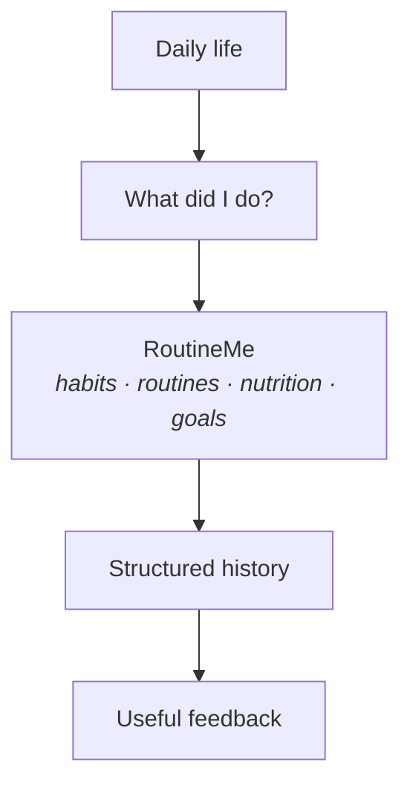

# RoutineMe — self-tracking without the chore

Tracking habits works best when the tracking itself doesn't become another habit you have to fight.

That's the problem RoutineMe exists to solve. Self-tracking is genuinely useful — you can't improve a routine you can't see. But logging is friction, and friction is what kills consistency. Most people abandon the tracker, not the habit.

I built RoutineMe as a lightweight place to keep the recurring parts of life together — habits, routines, goals, and nutrition — and the product is increasingly focused on one question: how much of the manual input can we remove while keeping the user in control of their own data?

<a href="docs/assets/product-today.png">
  
</a>

*Today view — habits, routines, and nutrition live in one daily workflow: a calorie gauge, macro totals, goals with progress, and the week at a glance.*



One place answers that question across everything being tracked. Nutrition is where the friction is most obvious — and where the interesting engineering lives.

## Nutrition, as the example that makes the point

Food logging is the clearest case of the problem. Search for every ingredient, fill out every field, get the portion right — most people give up before the entry is complete.

The alternative is to just *write what you ate*:

> "Two eggs, toast, and coffee."

RoutineMe turns that sentence into a structured proposal you can review before anything is saved.

<a href="docs/assets/product-meal-logging.png">
  
</a>

*Natural-language meal logging — a free-form description becomes a structured nutrition proposal, waiting for confirmation before it's written.*

This isn't a chatbot bolted onto a food diary. It's the same logging action the form produces, reached through natural language instead of a dozen fields.

## Turning a sentence into a safe, structured action

Here's what actually has to happen between "two eggs and toast" and a saved log entry:

```mermaid
flowchart TB
    U["User message"] --> C["Classify intent"]
    C --> N["Resolve foods<br/><i>against the user's own history</i>"]
    N --> E["Estimate nutrition<br/><i>unknown foods stay unknown</i>"]
    E --> P["Propose the change"]
    P --> CF["User confirms"]
    CF --> X["Execute"]
    EV["Behavior test cases<br/><i>(evals)</i>"] -.->|"score"| C
    EV -.->|"score"| E
    OB["Per-call metrics<br/><i>latency · tokens · cost</i>"] -.->|"record"| C
    OB -.->|"record"| E
    style EV fill:#1e3a2f,stroke:#27c93f
    style OB fill:#1e3a2f,stroke:#27c93f
```



A few things about that pipeline are worth calling out, because they're where the reliability actually comes from.

### One typed execution path for every write

The chat pipeline doesn't have its own private way to mutate data. Every change — whether it came from a tap in the UI or a typed sentence — flows through the same typed `Action` executor, with a `propose → confirm → execute` lifecycle. A natural-language log is not a special kind of write; it's the same write, reached through a different input path. That's what keeps the surface area of "things that can change state" small enough to reason about.

### Grounding against what you already told it

"Rice" should mean *the rice this user usually eats*, not whatever the model guesses. Before estimating, the assistant looks at the user's recent logs, ranks them by frequency and recency, and reuses previously-confirmed values verbatim when a food matches. There's no vector database or embedding pipeline — a bounded scan of the user's own history, degrading to empty when lookup fails.

That last part matters: it degrades to *nothing*, never to a guess.

## Making AI useful without making it reckless

The whole point of natural-language logging is that the model is doing something useful. The risk is that "useful" quietly turns into "plausible." RoutineMe draws the line with a few concrete rules:

- **An unknown food stays unknown.** "Some weird alien food xyzzy" comes back with `unknown: true` and zeroed macros, not invented ones. The system will log it as unknown rather than guess its nutrition.
- **A state-changing request never executes itself.** "Change my daily calorie target to 1,800" produces a proposal that says *Apply?* — nothing is written until the user confirms.
- **A confused model wastes latency, not data.** Any model-driven follow-up loop is hard-capped at three steps. A model can spin on an ambiguity; it can't take unbounded actions on real data.

The way these rules stay true across model and prompt changes is a repeatable evaluation harness. Checked-in cases pin the *behavior*: the classifier must route ambiguous input correctly, every known food must be covered, genuinely unknown foods must come back unknown. Scores are held to conservative floors, so a model or prompt change that degrades behavior fails the suite instead of shipping. The harness runs keyless — a deterministic stand-in for the live model — so it runs anywhere, and the live model runs the exact same cases against the same floors.

## Where it's headed

The larger question behind RoutineMe is what self-tracking looks like when the software does more of the remembering. The direction is toward more of the routine running proactively — the software knowing what you usually track and when, and preparing the entry for you to confirm rather than asking you to build it from scratch each time — while the user stays the one who decides what actually gets recorded.

## About this repository

RoutineMe is a larger private project, deployed and in active use. This public repository contains a public-safe slice of the AI engineering behind natural-language logging — the classification, retrieval, estimation, typed actions, and the evaluation harness that keeps them honest — so the behavior can be inspected and run without exposing the full application, its data, or its infrastructure.

## Run it locally

```bash
npm install
npm test
```

No API key, no network, no database. TypeScript strict, Zod-validated, Vitest.
