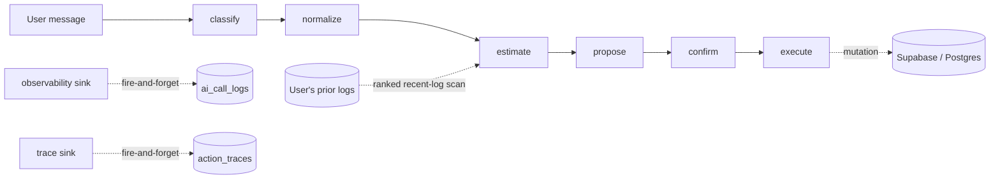

# Architecture

The production app is a habit + nutrition tracker with a natural-language chat surface. This showcase extracts only the **AI evidence layer** — the guardrails that make the LLM surface trustworthy — as pure, keyless TypeScript.

## Full pipeline (production context)



Each step is a typed function; the classifier and estimator are the two LLM calls. The loop back from execute to propose is the agentic loop, capped at `MAX_AGENTIC_DEPTH = 3`.

## Guardrails (shipped here)

| Module | Path | Role |
| --- | --- | --- |
| Golden eval harness | `src/eval/` | Scores classifier + estimator against checked-in fixtures, holds to regression floors. |
| Honest unknown-fallback | `src/chat-estimator.ts` | Fails closed to `allUnknown` on any error; never fabricates macros. |
| LLM observability | `src/llm-observability.ts` | Per-call latency/tokens/cost/fallback, fire-and-forget. |
| User-grounded retrieval | `src/retrieval.ts` | Bounded recent-log scan + frequency/recency ranking (no vector infra). |
| Bounded agentic loop | `src/agentic-loop.ts` | `MAX_AGENTIC_DEPTH=3` + Zod union gate. |
| Action types | `src/types.ts` | Zod discriminated union of all executable intents. |
| Prompts | `src/chat-prompt.ts` | Classifier / estimator / agentic-loop system prompts. |

## Supabase schema + RLS (OMITTED — private infra)

The production layer is deliberately **not shipped**. Its role, documented here so the story is truthful without leaking it:

- **Tables**: `logs`, `categories`, `goals`, `ai_call_logs`, `action_traces` (and auth-managed users).
- **Row-level security**: every table enforces `user_id = auth.uid()::text`, so a client can only read/write its own rows.
- **Admin path**: API routes use a service-role client for cross-user writes (observability, traces). This client **fails closed** — the observability/trace functions are no-ops when the secret key is absent, which is why the entire showcase runs keylessly.

In this repo, the observability and trace boundaries are injected sinks with no-op defaults, preserving the "never throw, never write unconfigured" contract while keeping the private schema out of the public tree.

## Data flow through the estimator

```
user message
  → classifier extracts item names (no macros)
  → retrieval scans user's recent nutrition logs, ranks by frequency+recency
  → estimator grounds in priorFoods, or tags unknown, or reuses logged macros
  → formatter emits ~-prefixed proposal + confirmation ask
  → confirmed → execute mutation
```

The golden fixtures pin the estimator's contract: known foods must resolve with all four macros and `unknown` unset; the alien-food case must resolve to exactly one `unknown: true` entry (bounds `[1, 1]`).
